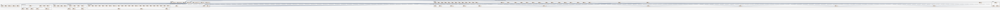

# Produktspesifikasjon: N50 Kartdata

*Kartdata tilpasset målestokkområdet 1:25 000 til 1:100 000. Produktet har et innhold som tilsvarer papirkartserien Norge 1:50 000 med unntak av bathymetri (dybder). Temaer som inngår i produktet er arealdekke (vann, markslag, etc.), administrative områder, bygninger og anlegg, høyde, restriksjonsområder, samferdsel og stedsnavn. N50 Kartdata dekker fastlands-Norge og er begrenset av riksgrensen mot nabolandene og territorialgrensen i havet. Produktet er kartografisk redigert med tanke på presentasjon i målestokk 1:50 000. N50 Kartdata ajourføres kontinuerlig og distribueres ukentlig.*

**Nøkkelord:** Kartdata, N50, N50 Kartdata, Landsdekkende, Nasjonalt datasett, 1:50 000, M711, Norge 1:50 000, Turkart, Norge 1:50000, 1:50000, Kart over Norge, N 50, Bakgrunnskart, Vann, 50, Kart, Norge fastland, Administrative enheter, Allmennyttige og offentlige tjenester, Arealdekke, Bygninger, Hydrografi, Høyde, Produksjons- og industrianlegg, Stedsnavn, Transportnett, Vernede områder, Inspire, Det offentlige kartgrunnlaget, geodataloven, Norge digitalt, beredskapsbase, fellesDatakatalog, Basis geodata, Norge

**Emnekategorier:** Basisdata

**Geografisk utstrekning**:

- **Vest**: 2.0
- **Øst**: 33.0
- **Sør**: 57.0
- **Nord**: 72.0

**Tidsmessig utstrekning**:

- **Tidsperiode**:
  - **Fra**: 2026-05-15
  - **Til**: 2026-05-15

## Om spesifikasjonen

> **Denne versjonen av produktspesifikasjonen:**  
> **Opprettet dato:**  
> **Endret dato:** 2026-05-15 
> **Språk:** nor 
> **Kontaktinformasjon:** Kartverket, [kundesenter@kartverket.no](mailto:kundesenter@kartverket.no)

## Om produktet N50 Kartdata

> **Romlig representasjonstype:** Vektor 
> **Unik identifikator:** <https://data.geonorge.no/sosi/kartdata/n50> 
> **Kontaktinformasjon:** Kartverket, [kundesenter@kartverket.no](mailto:kundesenter@kartverket.no)
>
> **Romlig oppløsning:**
>
> **Ekvivalent målestokk**: 50000
>
> **Begrensninger:**
>
> **Ressursbegrensninger**:
>
> - **Bruksbegrensninger**: Ingen begrensninger på bruk er oppgitt
>
> **Juridiske begrensninger**:
>
> - **Tilgangsbegrensninger**: Åpne data
> - **Bruksbegrensninger**: Lisens
> - **Lisens**: Creative Commons BY 4.0 (CC BY 4.0)
> - **Lisenslenke**: <https://creativecommons.org/licenses/by/4.0/>
>
> **Sikkerhetsbegrensninger**:
>
> - **Klassifisering**: Ugradert

### Bruksområde

Dataene egner seg blant annet for fremstilling av topografiske kart, temakart, turkart/fritidskart, interaktive kart, som datagrunnlag for kartløsninger på internett og i analysesammenheng.

## Omfang

### Hele datasettet

**Nivå**: dataset

**Nivåbeskrivelse**: Gjelder hele datasettet. Hvis omfang ikke er oppgitt under en overskrift, gjelder teksten for hele datasettet og alle leveranser

### Datamodell for N50 kartdata

**Nivå**: dataset

**Nivåbeskrivelse**: Viser full modell for N50 kartdata

## Datainnhold og struktur

### Datamodell - Datamodell for N50 kartdata

➡️ [Se full datamodell for omfang "Datamodell for N50 kartdata" (diagram per pakke og objektkatalog)](datamodell-for-n50-kartdata/objektkatalog.html)

## Referansesystem

| EPSG-kode | Navn på referansesystem |
| --- | --- |
| [EPSG:25832](https://epsg.io/25832) | [EUREF89 UTM sone 32, 2d](https://register.geonorge.no/epsg-koder) |
| [EPSG:25833](https://epsg.io/25833) | [EUREF89 UTM sone 33, 2d](https://register.geonorge.no/epsg-koder) |
| [EPSG:25835](https://epsg.io/25835) | [EUREF89 UTM sone 35, 2d](https://register.geonorge.no/epsg-koder) |

## Datakvalitet

**Nivå**: dataset

- **Kvalitetsmål**: COMMISSION REGULATION (EU) No 1089/2010 of 23 November 2010 implementing Directive 2007/2/EC of the European Parliament and of the Council as regards interoperability of spatial data sets and services
  **Målebeskrivelse**: Dataene er ikke vurdert iht produktspesifikasjonen
  **Beskrivende resultat**: Dataene er ikke vurdert iht produktspesifikasjonen

- **Kvalitetsmål**: SOSI produktspesifikasjon: N50 Kartdata
  **Målebeskrivelse**: Dataene er i henhold til produktspesifikasjonen
  **Beskrivende resultat**: Dataene er i henhold til produktspesifikasjonen

- **Kvalitetsmål**: Sosi applikasjonsskjema
  **Målebeskrivelse**: SOSI-filer er i henhold til applikasjonsskjema
  **Beskrivende resultat**: SOSI-filer er i henhold til applikasjonsskjema

- **Kvalitetsmål**: Sosi applikasjonsskjema
  **Målebeskrivelse**: GML-filer er i henhold til applikasjonsskjema
  **Beskrivende resultat**: GML-filer er i henhold til applikasjonsskjema

- **Kvalitetsmål**: Prosentvis oppfyllelse av FAIR-prinsipper
  **Målebeskrivelse**: Angir fullstendighet i forhold til krav fra FAIR-prinsippene (The FAIR Guiding Principles for scientific data management and stewardship)
  **Resultat**: 90

- **Kvalitetsmål**: FAIR
  **Resultat**: Prosentvis oppfyllelse av FAIR-prinsipper: 90%

## Vedlikehold

**Vedlikeholdsfrekvens**: Ukentlig

**Status**: Kontinuerlig oppdatert

## Presentasjon

**navn**: Tegneregler

**Lenke**:
<https://register.geonorge.no/tegneregler/spesifikasjon-for-skjermkartografi>

## Leveranse

| Tjeneste | Endepunkt | Type | Format | Leveranseenheter |
| --- | --- | --- | --- | --- |
| Geonorge nedlastning | [Lenke](https://nedlasting.geonorge.no/api/capabilities/) | GEONORGE:DOWNLOAD | FGDB, GML, PostGIS, SOSI | fylkesvis, kommunevis, landsfiler |
| Atom Feed | [Lenke](http://nedlasting.geonorge.no/geonorge/ATOM-feeds/N50Kartdata_AtomFeedFGDB.xml) | W3C:AtomFeed | FGDB | fylkesvis, kommunevis, landsfiler |
| Atom Feed | [Lenke](http://nedlasting.geonorge.no/geonorge/ATOM-feeds/N50Kartdata_AtomFeedGML.xml) | W3C:AtomFeed | GML | fylkesvis, kommunevis, landsfiler |
| Atom Feed | [Lenke](http://nedlasting.geonorge.no/geonorge/ATOM-feeds/N50Kartdata_AtomFeedPostGIS.xml) | W3C:AtomFeed | PostGIS | fylkesvis, kommunevis, landsfiler |
| Atom Feed | [Lenke](http://nedlasting.geonorge.no/geonorge/ATOM-feeds/N50Kartdata_AtomFeedSOSI.xml) | W3C:AtomFeed | SOSI | fylkesvis, kommunevis, landsfiler |
| Topografisk Norgeskart WMS | [Lenke](https://wms.geonorge.no/skwms1/wms.topo?service=wms&request=getcapabilities) | WMS-tjeneste | png |  |
| Norwegian Arctic SDI WMS |  | WMS-tjeneste | png |  |
| Kartdata WMS | [Lenke](https://wms.geonorge.no/skwms1/wms.kartdata?service=wms&request=getcapabilities) | WMS-tjeneste | OGC WMS |  |
| Topografisk Norgeskart gråtone WMS | [Lenke](https://wms.geonorge.no/skwms1/wms.topograatone?service=wms&request=getcapabilities) | WMS-tjeneste | png |  |
| Topografisk norgeskart WMTS / cache | [Lenke](https://cache.kartverket.no/v1/wmts/1.0.0/WMTSCapabilities.xml) | WMTS-tjeneste | OGC WMTS |  |
| Bakgrunnskart for Matrikkelen WMS | [Lenke](https://wms.geonorge.no/skwms1/wms.matrikkel_bakgrunn2/?service=wms&request=getcapabilities) | WMS-tjeneste | OGC WMS |  |

## Metadata

**Metadatastandard**: ISO19115

**Metadatastandardversjon**: 2003

**Metadatadato**: 2026-05-15

**språk**: nor

**Kontakt**:

- **Organisasjon**: Kartverket
- **Logo**: <https://register.geonorge.no/data/organizations/971040238_Kartverket_liten.png>
- **Epost**: kundesenter@kartverket.no
- **rolle**: pointOfContact

**Metadataidentifikator**:

- **Utsteder**: Geonorge
- **kode**: ea192681-d039-42ec-b1bc-f3ce04c189ac
- **koderom**: <https://kartkatalog.geonorge.no/metadata/>
- **Metadatalenke**: <https://kartkatalog.geonorge.no/metadata/ea192681-d039-42ec-b1bc-f3ce04c189ac>

## Tilleggsinformasjon

Trenger du hjelp til å laste ned og ta i bruk Kartverkets data og tjenester? På kartverket.no finner du tips og veiledning.
